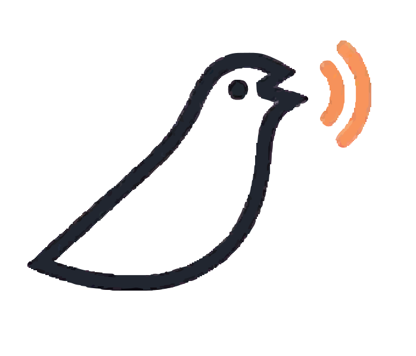

<p align="center">
  
</p>

<p align="center">
  <strong>AI voice-powered surveys.</strong><br/>
  Respondents speak instead of clicking. koel transcribes, surfaces themes, and gives you the <em>thinking</em> behind answers.
</p>

<p align="center">
  
  
  
  
  
  
</p>

---

## What it is

koel replaces multiple-choice surveys with open-ended voice conversations. A respondent clicks a link, speaks their answers, and koel handles transcription, theme clustering, and AI-powered insight queries — so survey creators get qualitative signal at scale.

---

## Monorepo layout

```
koel/
  frontend/          Next.js 16 app (App Router, TypeScript, Tailwind v4)
  backend/           Python FastAPI service (in progress)
  koel-ui-design-system/   Figma-exported design tokens + reference components
```

---

## Tech stack

| Layer         | Technology                                           |
| ------------- | ---------------------------------------------------- |
| Frontend      | Next.js 16, React 19, TypeScript 5, Tailwind CSS v4  |
| Auth          | Clerk (`@clerk/nextjs` v7)                           |
| Animations    | Framer Motion                                        |
| Backend       | Python FastAPI (Supabase DB)                         |
| Design system | Absans (display) + Manrope (body), CSS design tokens |

---

## Getting started

See `frontend/docs/building-the-project.md` for frontend setup, env vars, and scripts.

See `backend/docs/building-the-project.md` for backend setup, env vars, and scripts.

See `sonarqube.md` for the combined frontend/backend SonarQube analysis setup.

## Where to look first

**For AI agents and new developers — read in this order:**

1. `frontend/CLAUDE.md` — project rules, architecture decisions, known quirks (Clerk, Next.js 16 middleware, CSS tokens)
2. `frontend/docs/building-the-project.md` — setup, env vars, route groups
3. `frontend/docs/code-conventions.md` — folder structure, server/client component rules, styling conventions
4. `frontend/docs/wiring-with-mock-data.md` — how the data layer works, how to add new data functions
5. `koel-ui-design-system/README.md` — design tokens, palette, typography rules — read before touching any UI

Backend docs follow the same structure under `backend/docs/` (being added as backend phases complete).

---

## Contributing

- Name is always `koel`, never `Koel` or `KOEL`.
- Run `npm run typecheck && npm run build` before opening a PR — both must pass clean.
- Check `frontend/docs/issues-and-fixes.md` for known issues before filing a new one.
- UI Design questions → `koel-ui-design-system/README.md` is the source of truth.
- Backend Design questions → `backed/docs/architecture.md` is the source of truth
